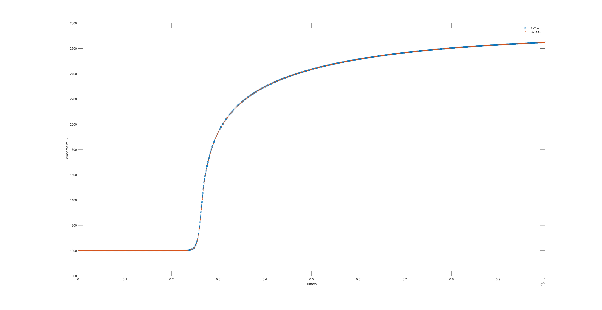
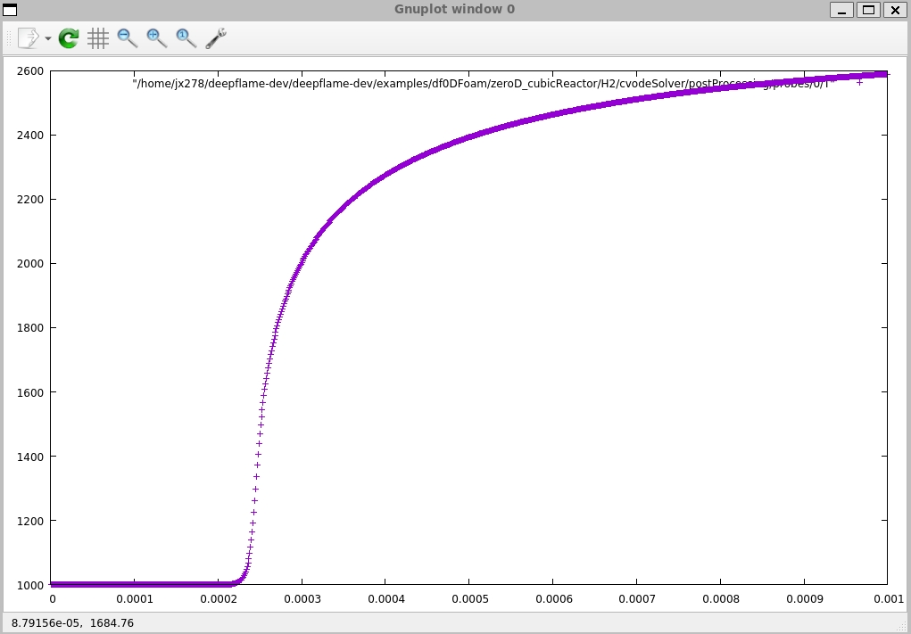

Two Examples 
===================

DeepFlame with DNN
--------------------------

If you choose to use PyTorch as the integratgor and use the compilation flag *--use_pytorch*, you can run examples stored in `$HOME/deepflame-dev/examples/.../pytorchIntegratgor`. To run an example, you first need to source your OpenFOAM:

.. code-block:: bash

    source $HOME/OpenFOAM/OpenFOAM-7/etc/bashrc

Then, source your DeepFlame:

.. code-block:: bash

    source $HOME/deepflame-dev/bashrc

Next, you can go to the directory of any example case that you want to run. For example:

.. code-block:: bash

    cd $HOME/deepflame-dev/examples/df0DFoam/zeroD_cubicReactor/H2/pytorchIntegratgor

This is an example for the zero-dimensional hydrogen combustion with PyTorch as the integrator. Networks used are stored in the *mechanisms* folder, and the inference file is `inference.py`. Configurations regarding DNN are included in `constant/CanteraTorchProperties`.

The case is run by simply typing: 

.. code-block:: bash

    ./Allrun

.. Note:: Users can go to `constant/CanteraTorchProperties` and check if `torch` is switched on. Switch it `on` to run DNN cases, and switch `off` to run CVODE cases.

If you plot PyTorch's result together with CVODE's result, the graph is expected to look like:

    
    Visualisation of 0D results from PyTorch and CVODE integrators 

DeepFlame without DNN
------------------------------
CVODE Integrator is the one without the application of Deep Neural Network (DNN). Follow the steps below to run an example of CVODE. Examples are stored in the directory: 
.. code-block:: bash

    $HOME/deepflame-dev/examples

To run these examples, first source your OpenFOAM, depending on your OpenFOAM path:

.. code-block:: bash

    source $HOME/OpenFOAM/OpenFOAM-7/etc/bashrc

Then, source your DeepFlame:

.. code-block:: bash

    source $HOME/deepflame-dev/bashrc

Next, you can go to the directory of any example case that you want to run. For example:

.. code-block:: bash

    cd $HOME/deepflame-dev/examples/df0DFoam/zeroD_cubicReactor/H2/cvodeIntegrator

This is an example for the zero-dimensional hydrogen combustion  with CVODE integrator.

The case is run by simply typing: 

.. code-block:: bash

    ./Allrun

The probe used for post processing is defined in ``/system/probes``. In this case, the probe is located at the coordinates (0.0025 0.0025 0.0025) to measure temperature variation with time. 
If the case is successfully run, the result can be found in ``/postProcessing/probes/0/T``, and it can be visualized by running: 

.. code-block:: bash

    gunplot
    plot "/your/path/to/postProcessing/probes/0/T"

You will get a graph:

    
    Visualisation of the zero-dimensional hydrogen combustion result with CVODE integrator
