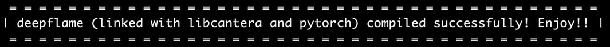

Installation
======================

Prerequisites
------------------------
The installation of DeepFlame is simple and requires **OpenFOAM-7**, **LibCantera**, and **PyTorch**.

.. Note:: If Ubuntu is used as the subsystem, please use `Ubuntu:20.04 <https://releases.ubuntu.com/focal/>`_ instead of the latest version. OpenFOAM-7 accompanied by ParaView 5.6.0 is not available for `Ubuntu-latest <https://releases.ubuntu.com/jammy/>`_.  

First install OpenFOAM-7 if it is not already installed. 

.. code-block:: bash

    sudo sh -c "wget -O - https://dl.openfoam.org/gpg.key | apt-key add -"
    sudo add-apt-repository http://dl.openfoam.org/ubuntu
    sudo apt-get update
    sudo apt-get -y install openfoam7

OpenFOAM-7 and ParaView-5.6.0 will be installed in the ``/opt`` directory. 

.. Note:: There is a commonly seen issue when installing OpenFOAM via ``apt-get install`` with an error message: ``could not find a distribution template for Ubuntu/focal``. To resolve this issue, you can refer to `issue#54 <https://github.com/deepmodeling/deepflame-dev/issues/54>`_.

**LibCantera** and **PyTorch** can be easily installed via `conda <https://docs.conda.io/en/latest/miniconda.html#linux-installers>`_. If you have compatible platform, run the following command to install DeepFlame.

.. code-block:: bash

    conda create -n deepflame python=3.8
    conda activate deepflame
    conda install -c cantera libcantera-devel
    conda install pytorch torchvision torchaudio pytorch-cuda=11.6 -c pytorch -c nvidia
    conda install pybind11 
    conda install -c conda-forge easydict

.. Note:: Please go to PyTorch's official website to check your system compatability and choose the installation command line that is suitable for your platform.  

.. Note:: Check your ``Miniconda3/envs/deepflame`` directory and make sure the install was successful (lib/ include/ etc. exist).

Configure
-------------------------
**1. Source your OpenFOAM-7 bashrc to configure the $FOAM environment.**

.. Note:: This depends on your own path for OpenFOAM-7 bashrc.  

If you have installed using ``apt-get install``, then:

.. code-block:: bash

    source /opt/openfoam7/etc/bashrc 
    
If you compiled from source following the `official guide <https://openfoam.org/download/7-source/>`_, then:

.. code-block:: bash

    source $HOME/OpenFOAM/OpenFOAM-7/etc/bashrc

.. Note:: Check your environment using ``echo $FOAM_ETC`` and you should get the directory path for your OpenFOAM-7 bashrc you just used in the above step.

**2. Clone the DeepFlame repository:**

.. code-block:: bash

    git clone https://github.com/deepmodeling/deepflame-dev.git

**3. Configure the DeepFlame environment:**

.. code-block:: bash
    
    cd deepflame-dev
    . configure.sh --use_pytorch
    source ./bashrc

.. Note:: Check your environment using ``echo $DF_ROOT`` and you should get the path for the ``deepflame-dev`` directory.

Build and Install
-------------------------------
Finally you can build and install DeepFlame: 

.. code-block:: bash

    . install.sh  

.. Note:: You may come accross an error regarding shared library ``libmkl_rt.so.2`` when libcantera is installed through cantera channel. If so, go to your conda environment and check the existance of ``libmkl_rt.so.2`` and ``libmkl_rt.so.1``, and then link ``libmkl_rt.so.2`` to ``libmkl_rt.so.1``.
    
.. code-block:: bash

    cd ~/miniconda3/envs/deepflame/lib
    ln -s libmkl_rt.so.1 libmkl_rt.so.2

**If you have compiled DeepFlame successfully, you should see the print message in your terminal:**

Other Options
-------------------------------
DeepFlame also provides users with LibTorch and CVODE (no DNN version) options. 

**1. If you choose to use LibTorch (C++ API for Torch), first create the conda env and install** `LibCantera <https://anaconda.org/conda-forge/libcantera-devel>`_:
    
.. code-block:: bash

    conda create -n df-libtorch
    conda activate df-libtorch
    conda install -c cantera libcantera-devel

Then you can pass your own libtorch path to DeepFlame.

.. code-block:: bash

    cd deepflame-dev
    . configure.sh --libtorch_dir /path/to/libtorch/
    source ./bashrc
    . install.sh

.. Note::  Some compiling issues may happen due to system compatability. Instead of using conda installed Cantera C++ lib and the downloaded Torch C++ lib, try to compile your own Cantera and Torch C++ libraries.

**2. If you just need DeepFlame's CVODE solver without DNN model, just install LibCantera via** `conda <https://docs.conda.io/en/latest/miniconda.html#linux-installers>`_.

.. code-block:: bash

    conda create -n df-notorch
    conda activate df-notorch
    conda install -c cantera libcantera-devel

If the conda env ``df-notorch`` is activated, install DeepFlame by running:

.. code-block:: bash

    cd deepflame-dev
    . configure.sh 
    source ./bashrc
    . install.sh

If ``df-notorch`` not activated (or you have a self-complied libcantera), specify the path to your libcantera:

.. code-block:: bash

    . configure.sh --libcantera_dir /your/path/to/libcantera/
    source ./bashrc
    . install.sh
