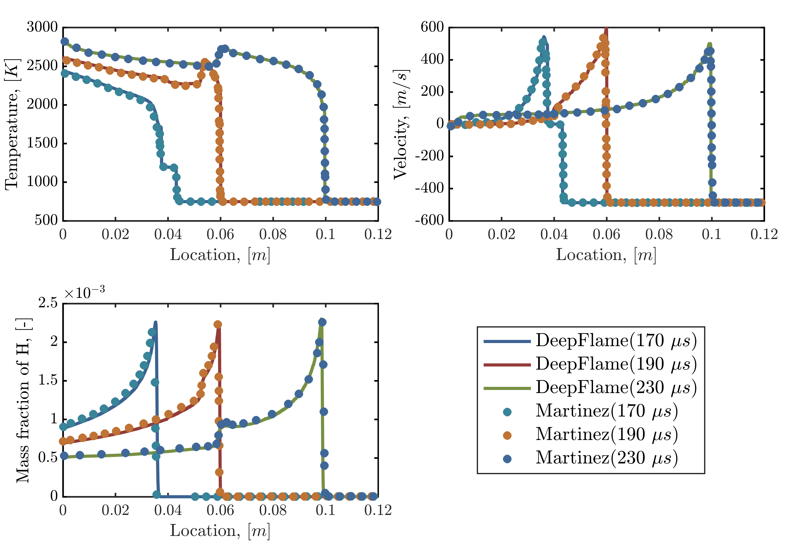
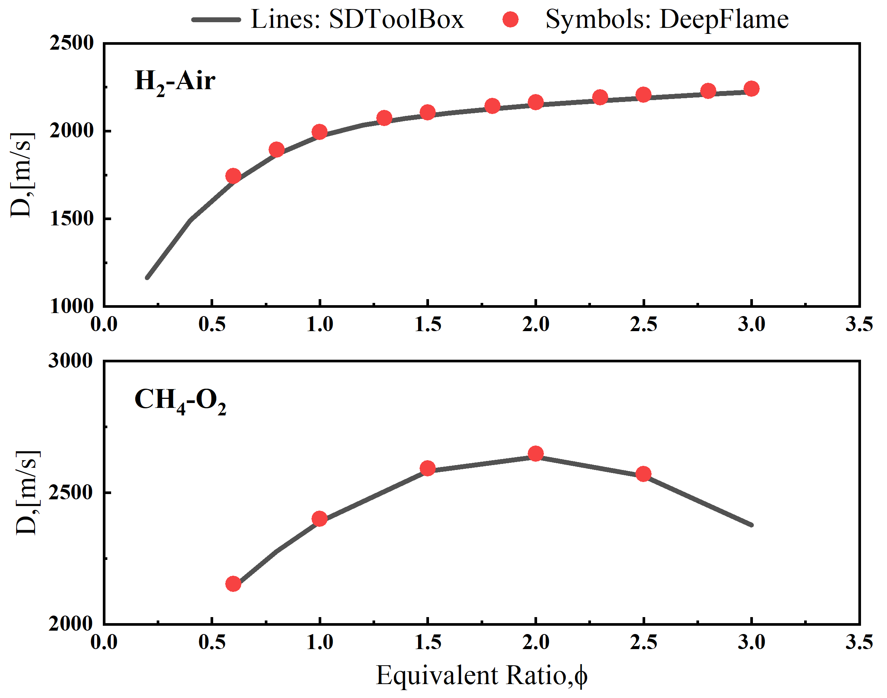
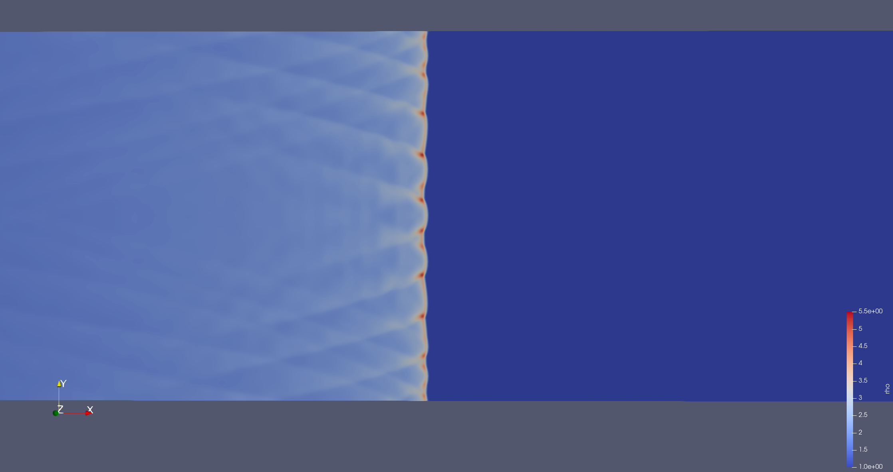
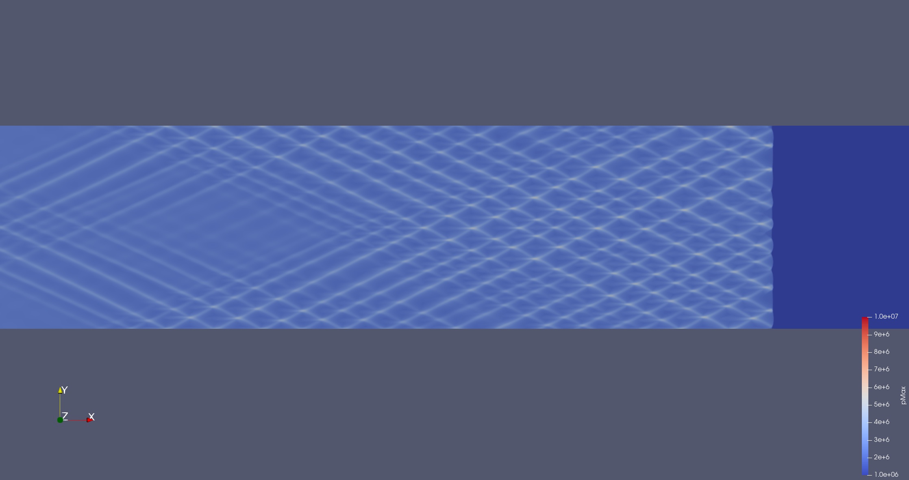

dfHighSpeedFoam
==================

One-Dimensional Reactive Shock Tube
----------------------------------------

**Problem Description**

The case simulates supersonic inlet flow hitting the wall and then reflected to ignite the premixed gas. The reactive wave will catch the reflected shock wave. This case can also verify the accuracy of our solver in capturing the interaction of convection and reaction.

.. list-table:: Operating Conditions in Brief
   :widths: 40 40 
   :header-rows: 0

   * - Chamber size (x)
     - 0.12 m
   * - Initial Gas Density
     - 0.072 kg/m^3 (x<=0.06 m), 0.18075 kg/m^3 (x>0.06 m) 
   * - Initial Gas Pressure
     - 7173 Pa (x<=0.06 m), 35594 Pa (x>0.06 m)
   * - Initial Gas Velocity
     - 0 m/s (x<=0.06 m), -487.34 m/s (x>0.06 m)
   * - Ideal Gas Composition (mole fraction)
     - H2/O2/Ar = 2/1/7 

**Output** 

   Result of one-dimensional reactive shock tube

**Reference**

E S Oran, T R Young, J P Boris, A Cohen, Weak and strong ignition. i. Numerical simulations of shock tube experiments, Combustion and Flame 48 (1982) 135-148.

R J Kee, J F Grcar, M D Smooke, J A Miller, E Meeks, Premix: A fortran program for modeling steady laminar one-dimensional premixed flames, Sandia National Laboratories.

One-Dimensional H2/Air Detonation
--------------------------------------------

**Problem Description**

Detonation propagation contains a complex interaction of the leading shock wave and auto-igniting reaction, showing the coupling of shock wave and chemical reaction. This case aims to validate the accuracy of this solver in capturing this process and the propagation speed.

.. list-table:: Operating Conditions in Brief
   :widths: 40 40 
   :header-rows: 0

   * - Chamber size (x)
     - 0.5 m
   * - Initial Gas Pressure
     - 90 atm (hot spot), 1 atm (other area)
   * - Initial Gas Temperature
     - 2000 K (hot spot), 300 K  (other area)
   * - Ideal Gas Composition (mole fraction)
     - H2/O2/N2 = 2/1/3.76
       (homogeneous stoichiometric mixture)

**Output** 

   Result of one-dimensional H2/air detonation

**Reference**

J Li, Z Zhao, A Kazakov, F L Dryer, An updated comprehensive kinetic model of hydrogen combustion, International Journal of Chemical Kinetics 36 (2004) 566-575.

Two-Dimensional H2/Air Detonation
--------------------------------------------

**Problem Description**

Detonation propagation contains a complex interaction of the leading shock wave and auto-igniting reaction, and two-dimensional detonation can further reveal the interaction of shear waves and shock waves.

.. list-table:: Operating Conditions in Brief
   :widths: 40 40 
   :header-rows: 0

   * - Chamber size (x)
     - 0.2 m * 0.01 m
   * - Initial Gas Pressure
     - 100 atm (three hot spot), 1 atm (other area)
   * - Initial Gas Temperature
     - 2000 K (three hot spot), 300 K  (other area)
   * - Ideal Gas Composition (mole fraction)
     - H2/O2/N2 = 2/1/7
       (homogeneous stoichiometric mixture)

**Output** 

Triple points can be seen clearly in the picture below.

   Density field of two-dimensional H2 detonation

In the picture below, during the propagation of detonation wave, we can see that the size of cells gradually became stable.

   
   History of maximum pressure during detonation propagation

**Reference**

C J Jachimowski, An Analytical Study of the Hydrogen-Air Reaction Mechanism with Application to Scramjet Combustion, NASA TP-2791, Feb. 1988.