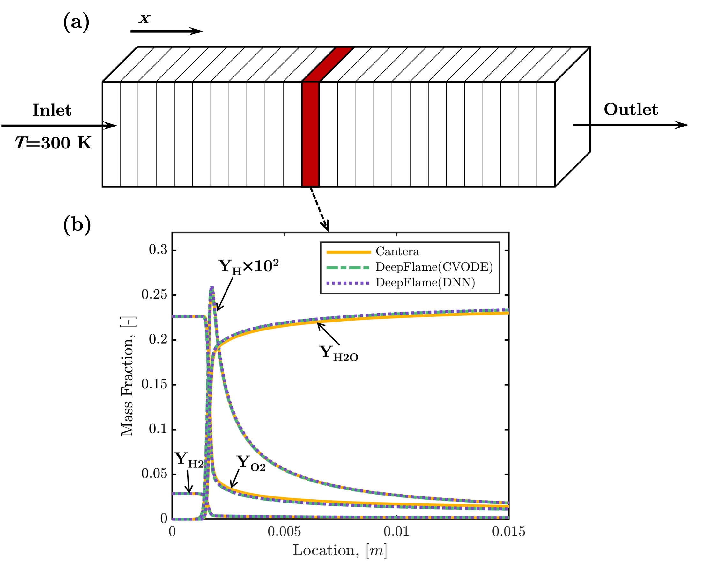

dfLowMachFoam
====================

One-Dimensional Planar Flame
----------------------------------------

**Problem Description**

The case simulates the steady-state 1D freely-propagating flame. The results are able to catch the flame thickness, laminar fame speed and the detailed 1D flame structure. This case demonstrate that the convection-diffusion-reaction algorithms implemented in our solver are stable and accurate.

.. list-table:: Operating Conditions in Brief
   :widths: 40 40 
   :header-rows: 0

   * - Computational Domain length
     - 0.06 m
   * - Mixture
     - Hydrogen-Air
   * - Equivalence Ratio
     - 1.0
   * - Inlet Gas Temperature
     - 300 K

**Output** 

   Numerical setup of one-dimensional premixed flame and the detailed flame structure obtained by our solver 

Two-Dimensional Triple Flame
--------------------------------------------

**Problem Description**

This case simulates the evolution of a 2D non-premixed planar jet flame to validate the capability of our solver for multi-dimensional applications.

.. list-table:: Operating Conditions in Brief
   :widths: 40 40 
   :header-rows: 0

   * - Computational Domain size (x)
     - 0.03 m * 0.05 m
   * - Jet Composition
     - H2/N2= 1/3 (fuel jet), Air (co-flow)
   * - Initial Velocity   
     - 5 m/s (fuel jet), 1 m/s (co-flow)
   * - Initial Gas Temperature
     - 1400 K (ignition region), 300 K  (other area)

**Output** 

   Simulation results of the two-dimensional jet flame. 

The initial condition and the evolution of the jet flame are presented in this figure. 

Two-Dimensional Reactive Taylor-Green Vortex
---------------------------------------------------

**Problem Description**

2D reactive Taylor-Green Vortex (TGV) which is simplified from the 3D reactive TGV below is simulated here. It can be used for debugging, validation of DNN models against CVODE solutions and so on.

The initial velocity, pressure and mass fraction fields are set according to a benchmark case established by Abdelsamie et al. The initial temperature of the cold gas is set to be 500 K. 

**Output**

The developed 2D TGV are displayed in the figures below.

   Profiles of temperature history and contours of temperature and species mass fraction at t = 0.5 ms (two reference time)
   
**Reference**

A.Abdelsamie, G.Lartigue, C.E.Frouzakis, D.Thevenin, The taylor-green vortex as a benchmark for high-fidelity combustion simulations using low-mach solvers, Computers & Fluids 223 (2021): 104935.

Two-Dimensional Flame in Homogeneous Isotropic Turbulence
----------------------------------------------------------

**Problem Description**

2D reacting flow with homogeneous isotropic turbulence (HIT) is simulated here. It can be used to simulate kinetic energy dissapation and qualitatively assess turbulence effects on combustion under the circumstances that 3D simulations are computationally prohibitive.

The domain is initially filled with CH4/air mixture with an equivalence ratio of 0.6 at atmospheric pressure. To initialize 2d HIT simulations, turbulence is generated follwing the procedure described by Vuorinen and Keskinen.

.. list-table:: Operating Conditions in Brief
   :widths: 40 40
   :header-rows: 0

   * - Computational Domain size (x)
     - 20*pi mm * 20*pi mm
   * - Initial Gas Temperature
     - 1800 K (ignition region), 800 K  (other area)
   * - Ignition region
     - Circle in the domain center with a radius of 1/10 domain length

The figure below shows contour of vorticity at initial time.

   
   Initial contours of temperature and  vorticity for the 2D reactive HIT

**Output**

The developed 2D HIT are displayed in the figures below.

   
   Contours of temperature and vorticity at t = 1.5 ms

**Reference**

Vuorinen, Ville, and K. Keskinen. "DNSLab: A gateway to turbulent flow simulation in Matlab." Computer Physics Communications 203 (2016): 278-289.

   
Three-Dimensional Reactive Taylor-Green Vortex
---------------------------------------------------

3D reactive Taylor-Green Vortex (TGV) which is a newly established benchmark case for reacting flow DNS codes is simulated here to evaluate the computational performance of our solver. 

The initial fields are set according to a benchmark case established by Abdelsamie et al. The figure below shows contours of vorticity magnitude and temperature as well as the x-direction profiles of species at initial time.

   Initial contours and profiles of vorticity magnitude, temperature, and species mass fraction for the reactive TGV

**Output** 

The developed TGV are displayed in the figures below. 

   Contours and profiles of temperature and species mass fraction at t = 0.5 ms

**Reference**

A.Abdelsamie, G.Lartigue, C.E.Frouzakis, D.Thevenin, The taylor-green vortex as a benchmark for high-fidelity combustion simulations using low-mach solvers, Computers & Fluids 223 (2021): 104935.

