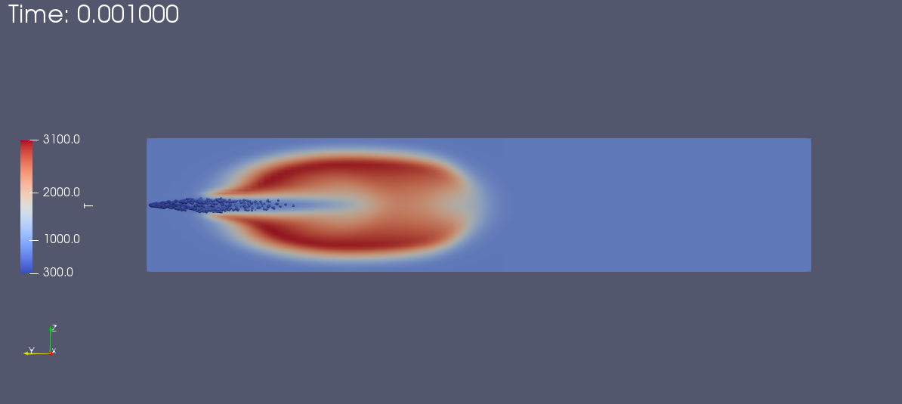
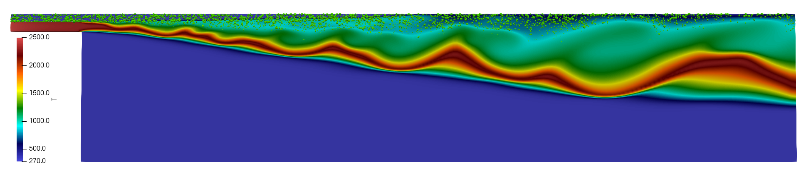

dfSprayFoam
=================

aachenBomb
------------------

**Problem Description**

This case simulates combustion inside a constant volume chamber based on an experimental setup at RWTH Aachen University. It can mimic, for example, the beginning of power stroke in a four-stroke diesel engine. 

.. list-table:: Operating Conditions in Brief
   :widths: 40 40 
   :header-rows: 0

   * - Chamber size (xyz)
     - 0.02×0.1×0.02m^3
   * - Initial Gas Temperature
     - 800K
   * - Initial Gas Pressure
     - 5MPa
   * - Initial Gas Composition (mass fraction)
     - 23.4% O2, 76.6% N2
   * - Fuel
     - n-heptane
   * - Fuel Temperature at the Nozzle
     - 320K
   * - Fuel Injection Duration
     - 1.25ms
   * - Total Injection Mass
     - 6mg

**Configurations Different from OpenFOAM Case**

Cantera is used instead of the built-in modules of OpenFOAM to solve the chemical reactions. Therefore, a chemical mechanism file in YAML format is required in the case directory, and the full name of the mechanism file ("xxx. yaml") should be the entry after the keyword **CanteraMechanismFile** in *constant/CanteraTorchProperties*. Non-reacting simulation can be conducted by switching the entry after the keyword **chemistry** from **on** to **off** in *constant/CanteraTorchProperties*.

**Results** 

   
   Visualization of temperature contours with large particle distribution

Sydney Spray Burner
------------------------

**Problem Description**

A 2D-wedge case is used to simulate the dilute spray combustion processes inside a spray burner based on the experimental setup at Sydney University. It has been widely used for the study of droplet-chemistry-turbulence interaction. 

.. list-table:: Operating Conditions in Brief (Details can be found for Case EtF4 in [1] )
   :widths: 40 40 
   :header-rows: 0

   * - Chamber size (wedge, 4 degree)
     - 0.104×0.500m^2
   * - Initial Gas Temperature in Domain
     - 293K
   * - Initial Gas Temperature at Fuel Inlet
     - 267K
   * - Initial Gas Temperature at Pilot Inlet
     - 2493K
   * - Initial Gas Pressure
     - 1Bar
   * - Initial Gas Composition in Domain(mass fraction)
     - 23.4% O2, 76.6% N2
   * - Fuel
     - C2H5OH
   * - Mass-flow Rate of Air Carrier 
     - 150g/min
   * - Liquid Fuel Injection Rate
     - 23.4g/min
   * - Bulk Jet Velocity 
     - 24m/s
   * - Bulk Burned Pilot Velocity
     - 11.6m/s

**Configurations Different from OpenFOAM Case**

Cantera is used instead of the built-in modules of OpenFOAM to solve the chemical reactions. Therefore, a chemical mechanism file in YAML format is required in the case directory, and the full name of the mechanism file ("xxx. yaml") should be the entry after the keyword **CanteraMechanismFile** in *constant/CanteraTorchProperties*. Non-reacting simulation can be conducted by switching the entry after the keyword **chemistry** from **on** to **off** in *constant/CanteraTorchProperties*.

**Note**

When running a wedge case with OpenFOAM, you may come across an error "**Hitting a wedge patch should not be possible**". One solution is to comment out the lines with the “**FatalErrorIn**” call in **src/lagrangian/basic/particle/particleTemplates.C**. Details can be found in the thread [2].

**Results** 

   
**Reference**

[1] Gounder, James Dakshina, Agisilaos Kourmatzis, and Assaad Rachid Masri. "Turbulent piloted dilute spray flames: Flow fields and droplet dynamics."   Combustion and flame 159.11 (2012): 3372-3397.

[2]https://www.cfd-online.com/Forums/openfoam/89003-3d-spray-vs-axisymmetric-spray-dieselfoam.html
